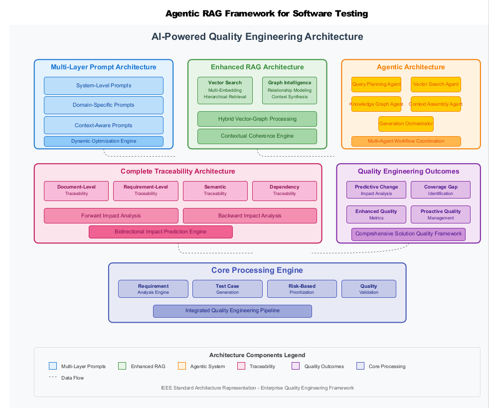

# 蘋果論文《Agentic RAG for Software Testing》重點摘要

**論文名稱:** Agentic RAG for Software Testing with Hybrid Vector-Graph and Multi-Agent Orchestration

**作者:** Mohanakrishnan Hariharan, Seshu Babu Barma, Satish Arvapalli, Evangeline Sheela Arulanandam

**發表日期:** 2025年10月16日

**論文連結:**
- [Apple Machine Learning Research](https://machinelearning.apple.com/research/hybrid-vector-graph)
- [arXiv (完整論文)](https://arxiv.org/abs/2510.10824)

---

### 論文核心目標

這篇論文旨在解決軟體品保（Quality Engineering, QE）中一個非常耗時的問題：手動創建和維護測試計畫、測試案例和自動化腳本。研究指出，品保工程師有 **30-40%** 的時間都花在這類基礎工作上。

### 提出的解決方案

研究團隊開發了一個名為 **「Agentic RAG」** 的自動化系統，其核心是一個結合了多項先進 AI 技術的框架：

1.  **自主式 AI 代理 (Autonomous AI Agents):**
    *   系統使用多個 AI 代理，這些代理可以像人類一樣自主地規劃、編寫和組織軟體測試。
    *   它們能自動生成從測試計畫到最終驗證報告的所有文件。

2.  **檢索增強生成 (Retrieval-Augmented Generation, RAG):**
    *   這是一種讓大型語言模型 (LLM) 在生成答案前，先從外部知識庫中檢索相關資訊的技術。
    *   這能有效減少模型產生「幻覺」（胡說八道）的機率，並確保產出內容的準確性和上下文關聯性。

3.  **混合向量圖譜知識系統 (Hybrid Vector-Graph Knowledge Systems):**
    *   這是他們 RAG 技術的核心。它不只使用傳統的向量搜尋（比對語意相似度），還結合了圖譜資料庫。
    *   **優點：** 這種混合方法能更好地理解和維持程式碼、業務邏輯和測試需求之間的複雜關係，確保了完整的 **可追溯性 (traceability)**。

4.  **多代理協同 (Multi-Agent Orchestration):**
    *   系統中的不同 AI 代理會分工合作，形成一個完整的自動化工作流程，涵蓋整個品保生命週期。
    *   使用的語言模型包括 **Gemini** 和 **Mistral**。

### 主要成果與亮點 (量化數據)

這個系統在企業內部系統和 SAP 遷移專案的實驗中取得了非常驚人的成果：

*   **準確度提升:** 從 **65%** 提升到 **94.8%**。
*   **測試時程縮短:** 減少了 **85%** 的時間。
*   **測試套件效率提升:** 提高了 **85%**。
*   **成本節省:** 預計可節省 **35%** 的成本。
*   **上線時間加速:** 讓專案提早了 **2 個月** 上線。

### 潛在的見解與啟發 (給您報告用的觀點)

1.  **AI 在軟體工程中的角色轉變：** 這項研究展示了 AI 不再只是輔助編碼的工具（例如 Copilot），而是能成為一個自主的 **「代理人」 (Agent)**，能獨立負責複雜且需要高度邏輯性的任務，例如軟體測試。

2.  **RAG 的進階應用：** 蘋果展示了 RAG 不僅僅是用於問答系統。透過結合圖譜資料庫，RAG 能夠處理需要嚴格邏輯和追溯性的專業領域（如軟體工程），這為 RAG 在其他專業領域的應用提供了範例。

3.  **「多代理系統」是趨勢：** 單一的 AI 模型有其極限。透過讓多個專門的 AI 代理分工合作，可以解決更複雜、更龐大的系統性問題。這可能是未來大型企業導入 AI 的主流模式。

4.  **商業價值巨大：** 報告中提到的「時程縮短 85%」、「成本節省 35%」等數據，對任何企業的管理者來說都極具吸引力。這證明了投資 AI 技術於軟體開發流程，能帶來非常具體的投資回報 (ROI)。

### 論文的局限性

研究人員也承認，目前的研究主要集中在「員工系統、財務和 SAP 環境」，因此其通用性到其他類型的軟體專案（例如嵌入式系統、移動應用等）還需要進一步驗證。

---

## 詳細技術架構分析

### 系統架構全景圖



**圖說：** Apple Agentic RAG 框架的完整系統架構（IEEE 標準架構表示法）

這張架構圖展示了系統的**六大核心模塊**及其數據流向：

#### **🔵 Multi-Layer Prompt Architecture（多層提示架構）**
- System-Level Prompts：系統級提示
- Domain-Specific Prompts：領域專用提示
- Context-Aware Prompts：上下文感知提示
- Dynamic Optimization Engine：動態優化引擎

#### **🟢 Enhanced RAG Architecture（增強型 RAG 架構）**
- Vector Search：向量搜尋（多嵌入、階層檢索）
- Graph Intelligence：圖譜智能（關係建模、上下文合成）
- Hybrid Vector-Graph Processing：混合處理層
- Contextual Coherence Engine：上下文一致性引擎

#### **🟠 Agentic Architecture（代理架構）**
- Query Planning Agent：查詢規劃代理
- Vector Search Agent：向量搜尋代理
- Knowledge Graph Agent：知識圖譜代理
- Context Assembly Agent：上下文組裝代理
- Generation Orchestrator：生成協調器
- Multi-Agent Workflow Coordination：多代理工作流協調

#### **🔴 Complete Traceability Architecture（完整可追溯性架構）**
- Document-Level Traceability：文檔級追溯
- Requirement-Level Traceability：需求級追溯
- Semantic Traceability：語意追溯
- Dependency Traceability：相依性追溯
- Forward & Backward Impact Analysis：前向與反向影響分析
- Bidirectional Impact Prediction Engine：雙向影響預測引擎

#### **🟣 Quality Engineering Outcomes（品質工程成果）**
- Predictive Change Impact Analysis：預測性變更影響分析
- Coverage Gap Identification：覆蓋率缺口識別
- Enhanced Quality Metrics：增強品質指標
- Proactive Quality Management：主動品質管理
- Comprehensive Solution Quality Framework：全面解決方案品質框架

#### **🔷 Core Processing Engine（核心處理引擎）**
- Requirement Analysis Engine：需求分析引擎
- Test Case Generation：測試案例生成
- Risk-Based Prioritization：基於風險的優先級排序
- Quality Validation：品質驗證
- Integrated Quality Engineering Pipeline：整合品質工程管道

**關鍵洞察：** 
- 虛線箭頭表示**數據流向**，展示各模塊如何協同工作
- 所有模塊最終匯集到 Core Processing Engine，形成**端到端的自動化管道**
- 這是一個完全符合 **IEEE 標準架構表示法**的企業級框架

---

### 1. 四階段漸進式方法論

這是論文的核心創新之一，系統透過四個階段逐步演進：

| 階段 | 技術 | 準確率 | 特點 |
|------|------|--------|------|
| **Stage 1** | Basic RAG | 65% | 傳統文件檢索 + 簡單提示工程 |
| **Stage 2** | Vector Search Enhancement | 78.4% | 語意相似度搜尋，改善上下文檢索 |
| **Stage 3** | Hybrid RAG | 87.1% | 向量搜尋 + 圖譜關係遍歷 |
| **Stage 4** | Agentic Systems | **94.8%** | 完整多代理協同 + 全面可追溯性 |

**關鍵洞察：** 這種漸進式方法降低了企業導入風險，每個階段都能帶來可衡量的改進，適合分階段投資和部署。

### 2. 混合向量-圖譜知識系統 (Hybrid Vector-Graph)

這是整個系統的技術核心，結合兩種不同的資料庫技術：

#### **向量資料庫層 (Vector Database Layer)**
- **平台：** SingleStore
- **向量維度：** 支援 384、768、1024 維度
- **相似度演算法：** Cosine、Euclidean、Dot Product
- **閾值設定：** 語意相似度 ≥ 0.82 才會被選為候選
- **嵌入模型：** Sentence Transformer

**用途：** 處理非結構化文本的語意搜尋，找出「意義相近」的測試案例和需求文件。

#### **圖譜資料庫層 (Graph Database Layer)**
- **平台：** TigerGraph Cloud
- **查詢引擎：** GSQL，具備優化的圖譜遍歷演算法
- **邊類型：** 15+ 種預定義關係類型，帶權重評分
- **圖譜演算法：** BFS、DFS、最短路徑、PageRank
- **記憶體配置：** 16GB heap

**關係建模包含 15 種邊類型：**
- `Requires`: 元件間的功能相依性
- `Validates`: 測試案例驗證特定需求
- `Depends_on`: 系統元件間的技術相依性
- `Impacts`: 變更影響關係
- `Covers`: 測試與需求的覆蓋關係

**用途：** 維護業務邏輯、系統元件、測試案例之間的複雜關係網絡，確保變更追蹤和影響分析。

### 3. 多代理協同架構 (Multi-Agent Orchestration)

系統部署了 **5 個專門的 AI 代理**，各司其職：

1. **Legacy Test Analysis & Business Intent Agent**
   - 分析歷史測試案例
   - 理解底層業務需求和驗證目標

2. **Functional Change Mapping Agent**
   - 將業務需求映射到應用功能
   - 識別與舊版實作的差異

3. **Integration Point Identification Agent**
   - 發現系統、模組、流程之間的介面
   - 標記需要特別測試關注的整合點

4. **Modernized Test Case Agent**
   - 使用現代方法論創建測試案例
   - 遵循最佳實踐模式

5. **Compliance Validation Agent**
   - 確保測試案例符合組織標準
   - 驗證監管合規性要求

#### **衝突解決引擎 (Conflict Resolution Engine)**
當多個代理產生衝突資訊時，系統使用 15 種解決策略：
- 基於歷史準確度的來源可信度加權
- 時間相關性優先（較新的更新）
- 關鍵衝突的領域專家驗證
- 無法解決衝突的自動升級機制

### 4. 提示工程框架 (Prompt Engineering Framework)

系統採用**五層階層式提示架構**：

1. **Context Layer（上下文層）：** 建立領域上下文和測試目標
2. **Specification Layer（規格層）：** 提供詳細需求和約束條件
3. **Template Layer（模板層）：** 定義輸出格式和結構
4. **Validation Layer（驗證層）：** 包含品質標準和驗證規則
5. **Enhancement Layer（增強層）：** 結合歷史知識和最佳實踐

**動態提示生成：** 提示會根據任務複雜度、可用上下文、歷史效能、使用者偏好和企業合規要求動態生成。

### 5. 完整可追溯性框架 (Comprehensive Traceability Framework)

系統維護**雙向可追溯性**：

- **需求 ↔ 測試案例**
- **測試案例 ↔ 執行結果**
- **業務邏輯 ↔ 驗證場景**
- **變更請求 ↔ 影響分析**

**變更影響分析引擎：** 能預測性地評估修改對整個測試生態系統的影響，自動識別受影響的測試案例、執行場景和驗證需求。

---

## 實驗結果深入分析

### 真實世界部署：SAP S/4HANA 遷移案例

**專案規模：**
- **測試案例數量：** 25,000 個需要創建、轉換和優化
- **涉及團隊：** 50+ 個團隊，各有獨特專案需求
- **SAP 模組：** 15 個模組，複雜的業務邏輯關係
- **外部系統整合：** 200+ 個外部系統和介面
- **遷移時程：** 從 ECC 6.0 到 S/4HANA，原定 18 個月

**技術挑戰：**
- 公司客製化的 T-codes
- 跨公司標準化的測試案例格式
- 不能將敏感資料送到 AI 系統（PII 資料需脫敏）
- 監管合規可追溯性要求

### 量化成果對比

#### **準確度與品質指標對比表**

| 方法 | 準確度 | 完整性 | 一致性 | 可追溯性 | 總體得分 |
|------|--------|--------|--------|----------|----------|
| Manual Testing | 92.3% | 85.7% | 78.2% | 73.6% | 80.4% |
| Template-Based | 76.5% | 82.1% | 89.3% | 89.3% | 79.78% |
| Basic RAG | 65.2% | 72.8% | 68.9% | 68.9% | 63.05% |
| GPT-4 Direct | 81.7% | 79.4% | 73.6% | 52.8% | 71.88% |
| SAP TAO | 84.2% | 88.5% | 91.7% | 78.9% | 85.83% |
| **Agentic RAG** | **94.8%** | **96.2%** | **95.7%** | **98.1%** | **96.2%** |

**關鍵發現：**
- Agentic RAG 在**所有維度**都超越傳統方法
- 相比手動測試，在**可追溯性**方面提升最顯著（+24.5%）
- 相比 GPT-4 直接使用，在**可追溯性**方面幾乎翻倍（+45.3%）

#### **效率與成本效益**

| 指標 | 改善幅度 | 具體數據 |
|------|----------|----------|
| **測試時程縮短** | 85% | 240小時 → 36小時 (每專案階段) |
| **成本節省** | 35% | 三個專案總體 |
| **上線加速** | 2個月 | 16個月提前交付 |
| **缺陷檢測率** | +35% | 系統測試階段 |
| **測試覆蓋率** | 98.7% vs 84% | +14.7% (相比手動基準) |
| **生產環境缺陷** | -92% | 部署後回歸問題 |

### 消融研究 (Ablation Studies)

研究團隊也進行了消融實驗，移除各個元件以了解其貢獻度：

| 移除的元件 | 準確度下降 |
|-----------|-----------|
| Enhanced Contextualization | **-18.2%** (影響最大) |
| Hybrid Vector-Graph | -15.7% |
| Multi-Agent Orchestration | -12.3% |
| Traceability Framework | -8.9% |

**結論：** 所有主要元件都對系統效能有顯著貢獻，其中**增強型上下文化引擎**貢獻最大。

---

## 給董事會報告的關鍵洞察 (Executive Insights)

### 🎯 **策略性洞察**

#### **1. AI 在軟體工程的範式轉移**

**現象：** 從「AI 輔助工具」進化到「AI 自主代理」
- **過去：** GitHub Copilot 等工具幫助開發者寫程式（輔助角色）
- **現在：** Apple 展示 AI 能**獨立負責**整個軟體測試生命週期（自主角色）
- **未來趨勢：** 多代理系統將成為企業級 AI 應用的標準架構

**對公司的意義：**
- 可以開始規劃「AI Agent 團隊」與人類團隊協作的混合工作模式
- 需要重新定義軟體工程師和 QA 工程師的角色定位
- 投資重點從「程式碼生成工具」轉向「任務自主代理系統」

#### **2. RAG 技術的企業級進化**

**技術突破：** 從簡單的「檢索+生成」進化到「向量+圖譜+多代理」
- **傳統 RAG：** 適合問答系統、客服機器人
- **混合 RAG：** 能處理需要嚴格邏輯和追溯性的專業領域
- **Agentic RAG：** 加入自主決策和任務分工能力

**商業應用潛力：**
- **軟體測試（本論文）**
- **合規性審查：** 監管文件、法律合約審查
- **技術文檔管理：** API 文檔、規格書自動生成與維護
- **知識管理系統：** 企業知識庫的智能化管理

#### **3. 投資回報率 (ROI) 極具吸引力**

| 商業指標 | 數值 | 財務影響 |
|---------|------|---------|
| 人力時間節省 | 85% | 人力成本直接下降 |
| 總成本節省 | 35% | 包含工具、人力、時程成本 |
| 上線加速 | 2個月 | 提早進入市場，增加營收機會 |
| 品質提升 | 缺陷 -92% | 降低維護成本和品牌風險 |

**投資建議：**
- 這類技術的 ROI 週期可能在 6-12 個月
- 適合從高重複性、高價值的流程開始導入（如軟體測試）
- 需要建立「AI 卓越中心 (AI Center of Excellence)」統籌導入

#### **4. 企業 AI 轉型的實踐路徑**

Apple 提供的**四階段漸進式方法**是企業轉型的典範：

```
Stage 1 (65% 效能) → 快速驗證概念
Stage 2 (78% 效能) → 引入語意搜尋
Stage 3 (87% 效能) → 混合資料架構
Stage 4 (95% 效能) → 完整代理系統
```

**優勢：**
- **降低風險：** 每階段都能產生價值，失敗成本低
- **學習曲線：** 團隊逐步適應新技術
- **預算友善：** 可以分階段投資，不需要一次性大投入

#### **5. 技術護城河的建立**

Apple 的這個系統展現了幾個關鍵的競爭優勢：

1. **領域知識圖譜：** 企業內部的關係網絡是最大資產
2. **歷史測試數據：** 25,000 個測試案例形成的知識庫
3. **客製化代理：** 針對特定業務邏輯優化的 AI 代理
4. **可追溯性基礎設施：** 合規性和品質保證的基石

**啟示：** 企業應該開始建構自己的「AI 資產」（知識圖譜、歷史數據、客製化模型），而不只是使用通用 AI 工具。

---

## 對聯發科技的潛在應用場景

基於論文的技術和 Apple 的成功經驗，以下是可能的應用方向：

### 📱 **晶片驗證與測試**
- **挑戰：** IC 驗證極其複雜，測試案例數量龐大
- **應用：** 自動生成驗證計畫、測試向量和覆蓋率報告
- **效益：** 縮短晶片驗證週期，提高測試覆蓋率

### 🔧 **軟體平台測試 (Android, IoT)**
- **挑戰：** 支援多種設備、多個 Android 版本，測試矩陣巨大
- **應用：** 自動化測試案例生成、回歸測試優化
- **效益：** 提升軟體品質，加速產品上市時程

### 📚 **技術文檔管理**
- **挑戰：** 晶片規格書、API 文檔維護困難
- **應用：** 自動生成和更新技術文檔，維護規格變更追溯
- **效益：** 降低文檔維護成本，提升客戶滿意度

### 🏢 **企業系統 (ERP/SAP) 升級**
- **挑戰：** 企業系統升級的測試工作量龐大
- **應用：** 直接套用 Apple 的 SAP 測試方法論
- **效益：** 降低升級風險和成本

---

## 競爭態勢分析

### 業界動態

| 公司 | 技術方向 | 比較 |
|------|---------|------|
| **Apple** | Agentic RAG for Testing | **領先** - 完整的多代理系統 + 企業驗證 |
| **Microsoft** | GitHub Copilot for Testing | 輔助生成，非自主代理 |
| **Google** | Bard for Code / Project IDX | 通用 AI，缺乏專門測試優化 |
| **Amazon** | CodeWhisperer | 主要聚焦程式碼補全，非測試 |
| **OpenAI** | ChatGPT / GPT-4 | 通用模型，但缺乏企業可追溯性 |

**Apple 的差異化優勢：**
1. 企業級可追溯性（監管合規必需）
2. 混合向量-圖譜架構（技術門檻高）
3. 經過大規模真實專案驗證（25,000 測試案例）

---

## 技術挑戰與風險

### 論文承認的限制

1. **領域專業化：** 目前實作聚焦在員工系統、財務和 SAP 環境
   - **影響：** 推廣到其他領域需要額外訓練數據
   
2. **知識庫維護：** 混合知識庫需要持續維護
   - **影響：** 業務流程演變時需要更新圖譜和向量庫

3. **整合複雜度：** 企業系統整合需要專業知識
   - **影響：** 導入成本和時程可能較長

### 我們需要關注的技術風險

1. **資料隱私與安全：** 論文提到需要 PII 脫敏
2. **模型可解釋性：** AI 決策的透明度對合規重要
3. **依賴性風險：** 過度依賴特定 LLM 供應商（Gemini, Mistral）
4. **成本控制：** LLM API 呼叫成本在大規模應用時可能很高

---

## 建議行動方案

### 短期行動 (3-6個月)

1. **✅ 成立 POC 小組：** 選擇一個內部測試痛點進行概念驗證
2. **✅ 技術評估：** 評估向量資料庫和圖譜資料庫的選型
3. **✅ 數據盤點：** 盤點現有測試案例、需求文件等可用數據
4. **✅ 人才準備：** 培訓團隊了解 RAG、Agent 等技術

### 中期行動 (6-12個月)

1. **🚀 試點專案：** 在一個產品線上全面導入
2. **🚀 建立知識圖譜：** 開始建構公司的技術知識圖譜
3. **🚀 客製化代理：** 針對特定業務邏輯開發專門代理
4. **🚀 整合現有工具：** 與 JIRA、TestRail 等工具整合

### 長期策略 (1-2年)

1. **🎯 AI 卓越中心：** 建立跨部門的 AI 應用推廣中心
2. **🎯 平台化：** 將 Agentic RAG 能力平台化，服務多個團隊
3. **🎯 生態系統：** 建立合作夥伴生態，擴展應用場景
4. **🎯 持續創新：** 追蹤學術前沿，保持技術領先

---

## 參考資源

### 相關論文（Apple 同期發布）

1. **Software Defect Prediction using Autoencoder Transformer Model**
   - 使用 AI 預測程式碼中可能出現 Bug 的位置
   - 準確率達 98.08%

2. **Training Software Engineering Agents and Verifiers with SWE-Gym**
   - 訓練 AI Agent 實際修復 Bug
   - 在 2,438 個真實 Python 任務上達到 72.5% 解決率

### 技術關鍵字

- Agentic RAG
- Multi-Agent Orchestration
- Hybrid Vector-Graph Database
- Retrieval-Augmented Generation
- LLM (Large Language Models)
- Software Testing Automation
- Enterprise Knowledge Graph

---

## 總結

這篇論文是 Apple 在軟體工程 AI 應用上的重大突破，展現了從「AI 輔助工具」到「AI 自主代理」的典範轉移。其技術架構（混合向量-圖譜 + 多代理系統）和實驗成果（94.8% 準確率、85% 時程縮短、35% 成本節省）都極具說服力。

對聯發科技而言，這項技術可以直接應用於晶片驗證、軟體測試、技術文檔管理等多個領域。建議盡快啟動概念驗證，搶佔技術先機，建立自己的 AI 資產和競爭優勢。

**關鍵行動：** 成立跨部門工作小組，選擇一個高價值場景，在 3-6 個月內完成 POC 驗證。

---

**報告準備人：** Paul  
**日期：** 2025年10月22日  
**報告對象：** 董事長 (11月B報告)
